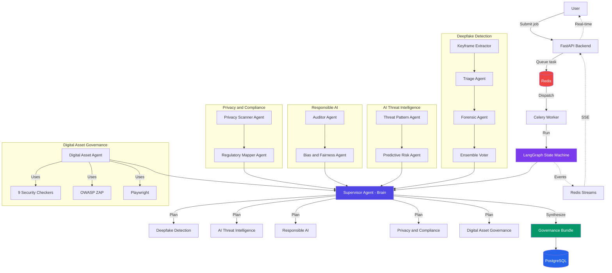
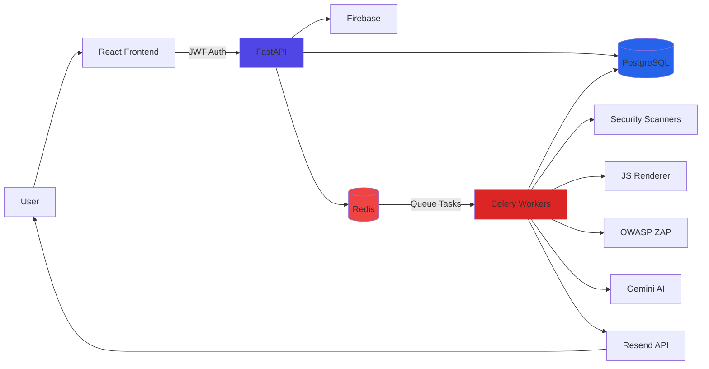
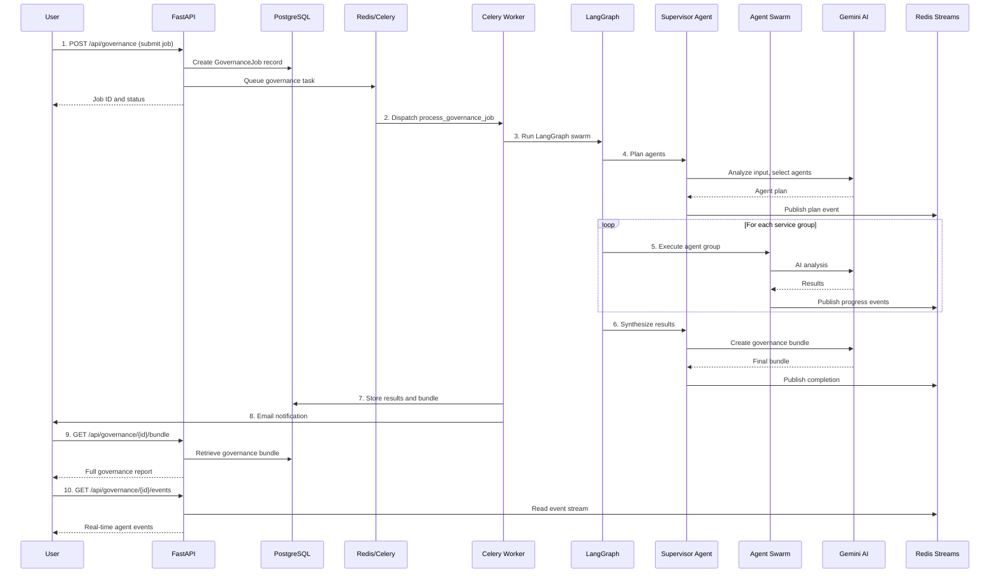

# VibeSecure V2

**Team:** The Build Guild

**Members:**

- [Sandipan Singh (Leader)](https://github.com/sandipansingh)
- [Zulekha Aalmi](https://github.com/Zulekha01)
- [Shakshi Kotwala](https://github.com/Shakshi-Kotwala)
- Kartavya Kumar

**[Watch Demo Video](https://youtu.be/40hJxE1rz_k)**

---

## About VibeSecure V2

VibeSecure is a **complete AI-native governance platform** that helps individuals, creators, developers, businesses, governments, and enterprises safely manage AI-generated content, websites, and custom AI systems.

It solves the real-world problems created by generative AI: deepfakes, AI-powered attacks, lack of ethical oversight, and regulatory non-compliance. Instead of using multiple fragmented tools, users get **one unified, easy-to-use platform** that covers **all four pillars of AI and Cybersecurity Governance** plus a full website security scanning service.

Everything runs **locally** in Docker -- your data never leaves your machine.

---

## The Four Pillars + Fifth Service

1. **Deepfake Detection Service**
2. **AI Threat Intelligence Service** (including testing of user's own AI systems)
3. **Responsible AI Frameworks Service**
4. **Data Privacy and Regulatory Compliance Service**
5. **Digital Asset Governance Service** (Owner-based Website Security Scanning)

---

## How Every Feature Works

### 1. Deepfake Detection Service
- User uploads a **photo** or **short video** (up to 5 minutes).
- **Keyframe Extractor Agent** (CPU-only, FFmpeg) intelligently picks 8-15 representative frames.
- **Deepfake Triage Agent** does a fast first-pass check with Gemini Flash.
- **Forensic Artifact Agent** performs detailed frame-by-frame analysis (facial inconsistencies, lighting mismatches, temporal anomalies, audio artifacts).
- **Ensemble Voter Agent** combines all results and does semantic similarity search in the RAG knowledge base (Celeb-DF v2, FaceForensics++, DFDC, DeeperForensics).
- Output: Confidence score, visual heatmap overlay, plain-English explanation, and dataset match notes.

### 2. AI Threat Intelligence Service (Including Custom AI System Testing)
- **For uploaded content**: Scans for hidden adversarial patterns, suspicious text, or API behavior.
- **Testing your own AI system**:
  - User provides their own AI system's **API endpoint** plus authentication.
  - With **explicit consent**, the **Threat Pattern Agent** generates and sends safe test attacks (prompt injection, adversarial inputs, model extraction queries).
  - The **Predictive Risk Agent** analyzes responses and calculates a risk score.
  - Report shows exact successful attacks, risk score, and ready-to-apply fixes.

### 3. Responsible AI Frameworks Service
- User uploads AI-generated content or describes their AI system.
- **Responsible AI Auditor Agent** and **Bias and Fairness Agent** evaluate against NIST AI Risk Management Framework and Google Secure AI Framework (SAIF).
- Produces a **simple scorecard** (Transparency, Fairness, Accountability, Safety, etc.).
- Gives plain-English suggestions with full reasoning trace for developers.

### 4. Data Privacy and Regulatory Compliance Service
- **Privacy Scanner Agent** detects PII, missing or weak consent banners, and privacy policy gaps.
- **Regulatory Mapper Agent** maps findings to exact articles of GDPR, CCPA, DPDP Act (India), and EU AI Act.
- Generates professional **compliance reports** (JSON).

### 5. Digital Asset Governance Service (Owner-based Website Security Scanning)
- **Mandatory ownership verification**: User places a token on their domain.
- After verification, runs full checks (security headers, TLS, CORS, cookies, exposed endpoints, vulnerable libraries).
- Can use Playwright for JavaScript rendering and OWASP ZAP for active testing (with consent).
- Results can automatically feed into Privacy Scanner and Regulatory Mapper for cross-service analysis.

---

## User Journey

1. User logs in (Firebase Authentication).
2. Chooses any service or "All Services".
3. Uploads content, enters website URL, or connects their own AI system API.
4. For websites: proves ownership (one-time verification token).
5. Gives explicit consent for deeper tests.
6. **Supervisor Agent** plans and spawns the required agents.
7. Agents collaborate via Redis Streams and shared state.
8. Final **Governance Bundle** is generated with confidence scores, risk scores, scorecards, compliance reports, and actionable fixes.
9. User receives email notification.

---

## 11-Agent Swarm Architecture

The system is built on a **LangGraph state machine** where a Supervisor Agent orchestrates 11 domain-specific agents:

| Agent | Service | Model Tier | Role |
|-------|---------|------------|------|
| **Supervisor** | All | Brain (Gemini 3.1 Pro Preview) | Orchestration, planning, synthesis |
| **Keyframe Extractor** | Deepfake | CPU-only (FFmpeg) | Extract frames from video/images |
| **Deepfake Triage** | Deepfake | Agent (Gemini Flash) | Fast first-pass deepfake check |
| **Forensic Artifact** | Deepfake | Agent (Gemini Flash) | Frame-by-frame forensic analysis |
| **Ensemble Voter** | Deepfake | Agent (Gemini Flash) | Majority vote + RAG knowledge base |
| **Threat Pattern** | Threat Intel | Agent (Gemini Flash) | MITRE ATLAS + safe AI system testing |
| **Predictive Risk** | Threat Intel | Agent (Gemini Flash) | Attack forecasting and risk prediction |
| **Responsible AI Auditor** | Responsible AI | Agent (Gemini Flash) | NIST AI RMF + Google SAIF evaluation |
| **Bias and Fairness** | Responsible AI | Agent (Gemini Flash) | Bias detection across 8 dimensions |
| **Privacy Scanner** | Privacy | Agent (Gemini Flash) | PII + consent banner + policy analysis |
| **Regulatory Mapper** | Privacy | Agent (Gemini Flash) | GDPR/CCPA/DPDP/EU AI Act mapping |
| **Digital Asset Governance** | Digital Asset | Agent (Gemini Flash) | Owner-verified website scanning |

### Model Fallback Strategy

- **Brain agents** (Supervisor): `gemini-3.1-pro-preview` then `gemini-2.5-pro` then `gemini-2.5-flash`
- **Normal agents**: `gemini-3-flash-preview` then `gemini-2.5-flash`
- Automatic retry with exponential backoff on transient errors (rate limits, 429, 503)

### Agent Collaboration
- Agents communicate via **Redis Streams** for real-time event publishing
- **Shared LangGraph state** passes results between agents
- Cross-service collaboration: Deepfake agents pass findings to Threat Pattern Agent; Privacy Scanner feeds into Regulatory Mapper; Digital Asset results can trigger Privacy Scanner


## How It Works

### V2 Governance Flow

1. **Submit a Governance Job**: Provide a URL, upload media (image/video), or describe your AI system
2. **Supervisor Plans**: The brain agent analyzes your input and selects which agents to run
3. **Agent Swarm Executes**: Selected agents run in parallel within their service groups, passing results downstream
4. **Governance Bundle**: The Supervisor synthesizes all findings into a unified governance report with scores, risks, and recommendations

### V1 Security Scan Flow (Preserved)

1. **Provide Your URL**: Submit your website URL for security analysis
2. **Verify Ownership**: Place a verification token on your domain (like Google Search Console)
3. **9 Parallel Checks**: Headers, HTTPS, TLS, CORS, libraries, directories, endpoints, reflections, content
4. **AI Analysis**: Google Gemini synthesizes findings into actionable guidance
5. **Get Results**: View detailed findings, severity ratings, and copy-paste fix configs

### Safe-by-Default

- Domain ownership verification before any scanning
- Separate explicit consent for active scanning
- All passive checks by default (no intrusive probing)
- Rate-limited and responsible scanning behavior
- Media uploads are validated and size-limited (100 MB max)

## 🏗️ System Architecture

### V2 Agent Swarm Architecture


```mermaid
flowchart TB
    User[User] -->|Submit job| API[FastAPI Backend]
    API -->|Queue task| Redis[(Redis)]
    Redis -->|Dispatch| Worker[Celery Worker]

    Worker -->|Run| Graph[LangGraph State Machine]

    Graph --> Supervisor[Supervisor Agent - Brain]

    Supervisor -->|Plan| DF[Deepfake Detection]
    Supervisor -->|Plan| TI[AI Threat Intelligence]
    Supervisor -->|Plan| RA[Responsible AI]
    Supervisor -->|Plan| PR[Privacy and Compliance]
    Supervisor -->|Plan| DA[Digital Asset Governance]

    subgraph Deepfake Detection
        KE[Keyframe Extractor]
        TA[Triage Agent]
        FA[Forensic Agent]
        EV[Ensemble Voter]
        KE --> TA --> FA --> EV
    end

    subgraph AI Threat Intelligence
        TP[Threat Pattern Agent]
        PRD[Predictive Risk Agent]
        TP --> PRD
    end

    subgraph Responsible AI
        AU[Auditor Agent]
        BF[Bias and Fairness Agent]
        AU --> BF
    end

    subgraph Privacy and Compliance
        PS[Privacy Scanner Agent]
        RM[Regulatory Mapper Agent]
        PS --> RM
    end

    subgraph Digital Asset Governance
        DAG[Digital Asset Agent]
        DAG -->|Uses| Checkers[9 Security Checkers]
        DAG -->|Uses| ZAP[OWASP ZAP]
        DAG -->|Uses| PW[Playwright]
    end

    EV --> Supervisor
    PRD --> Supervisor
    BF --> Supervisor
    RM --> Supervisor
    DAG --> Supervisor

    Supervisor -->|Synthesize| Bundle[Governance Bundle]
    Bundle --> DB[(PostgreSQL)]

    Graph -.->|Events| Stream[Redis Streams]
    Stream -.->|SSE| API
    API -.->|Real-time| User

    style Supervisor fill:#4f46e5,color:#fff
    style Graph fill:#7c3aed,color:#fff
    style Bundle fill:#059669,color:#fff
    style DB fill:#2563eb,color:#fff
    style Redis fill:#ef4444,color:#fff
```

### V1 System Architecture (Preserved)


```mermaid
flowchart LR
    User[User] --> Frontend[React Frontend]
    Frontend -->|JWT Auth| API[FastAPI]

    API --> Firebase[Firebase]
    API --> DB[(PostgreSQL)]
    API --> Cache[(Redis)]

    Cache -->|Queue Tasks| Worker[Celery Workers]

    Worker --> Scanners[Security Scanners]
    Worker --> Playwright[JS Renderer]
    Worker --> ZAP[OWASP ZAP]

    Worker --> AI[Gemini AI]
    Worker --> Email[Resend API]

    Worker --> DB
    Email --> User

    style API fill:#4f46e5
    style Worker fill:#dc2626
    style DB fill:#2563eb
    style Cache fill:#ef4444
```

### Process Flow (V2 Governance)


```mermaid
sequenceDiagram
    participant User
    participant API as FastAPI
    participant DB as PostgreSQL
    participant Redis as Redis/Celery
    participant Worker as Celery Worker
    participant Graph as LangGraph
    participant Supervisor as Supervisor Agent
    participant Agents as Agent Swarm
    participant Gemini as Gemini AI
    participant Stream as Redis Streams

    User->>API: 1. POST /api/governance (submit job)
    API->>DB: Create GovernanceJob record
    API->>Redis: Queue governance task
    API-->>User: Job ID and status

    Redis->>Worker: 2. Dispatch process_governance_job
    Worker->>Graph: 3. Run LangGraph swarm

    Graph->>Supervisor: 4. Plan agents
    Supervisor->>Gemini: Analyze input, select agents
    Gemini-->>Supervisor: Agent plan
    Supervisor->>Stream: Publish plan event

    loop For each service group
        Graph->>Agents: 5. Execute agent group
        Agents->>Gemini: AI analysis
        Gemini-->>Agents: Results
        Agents->>Stream: Publish progress events
    end

    Graph->>Supervisor: 6. Synthesize results
    Supervisor->>Gemini: Create governance bundle
    Gemini-->>Supervisor: Final bundle
    Supervisor->>Stream: Publish completion

    Worker->>DB: 7. Store results and bundle
    Worker->>User: 8. Email notification

    User->>API: 9. GET /api/governance/{id}/bundle
    API->>DB: Retrieve governance bundle
    API-->>User: Full governance report

    User->>API: 10. GET /api/governance/{id}/events
    API->>Stream: Read event stream
    API-->>User: Real-time agent events
```

## Google Technologies Used

| Technology | Usage | Impact |
| :---- | :---- | :---- |
| **Gemini 3.1 Pro Preview** | Brain-tier agent (Supervisor) planning and synthesis | Most capable reasoning for orchestration decisions |
| **Gemini 2.5 Pro** | Brain-tier fallback | Reliable fallback for complex reasoning tasks |
| **Gemini 3 Flash Preview** | Normal agent analysis (deepfake, threat, audit, privacy) | Fast, cost-effective agent execution |
| **Gemini 2.5 Flash** | Universal fallback for all agent tiers | Ensures no agent ever fails due to model unavailability |
| **Firebase Auth** | User authentication via Google OAuth and Email | Secure, zero-config identity management |
| **Firebase Admin SDK** | Backend JWT verification, user management | Stateless, scalable auth middleware |

## 🛠️ Tech Stack

[](https://skillicons.dev)


### Backend Technologies

**Core Framework**

- **Python 3.10+** - Modern Python with type hints
- **FastAPI 0.109+** - High-performance async web framework
- **Uvicorn** - Lightning-fast ASGI server
- **Pydantic** - Data validation with Python type annotations

**Agent Orchestration**

- **LangGraph 0.2+** - State machine orchestration for multi-agent workflows
- **Google Gemini (google-genai 0.1+)** - Multi-model AI with automatic fallback chains
- **Redis Streams** - Real-time agent event publishing and consumption

**Database & ORM**

- **PostgreSQL** - Production-grade relational database
- **SQLModel 0.0.14+** - SQL databases with Python type hints (combines SQLAlchemy + Pydantic)
- **psycopg2-binary 2.9+** - PostgreSQL adapter

**Task Queue & Caching**

- **Celery 5.3+** - Distributed task queue for async processing
- **Redis 5.0+** - In-memory data store for caching, message broker, and event streams

**Security Scanning**

- **Playwright 1.40+** - Headless browser automation for JavaScript rendering
- **OWASP ZAP** - Active vulnerability scanner
- **BeautifulSoup4 4.12+** - HTML/XML parsing for content analysis
- **httpx 0.26+** - Async HTTP client for scanning requests

**Media Processing**

- **FFmpeg** - CPU-only video keyframe extraction and audio analysis

**Authentication & Authorization**

- **Firebase Admin SDK 6.0+** - Backend authentication and user management
- **JWT tokens** - Stateless authentication

**Reporting**

- **ReportLab 3.6+** - PDF report generation

**Integrations**

- **Resend 0.7+** - Transactional email API

### Frontend Technologies

**Core Framework**

- **React 18.3+** - Modern UI library with hooks
- **Vite 5.1+** - Next-generation frontend tooling

**Styling & UI**

- **TailwindCSS 3.4+** - Utility-first CSS framework
- **Framer Motion 11.0+** - Production-ready animation library
- **Lucide React 0.344+** - Beautiful, consistent icons

**Authentication**

- **Firebase SDK 12.8+** - Frontend authentication (Google OAuth, Email/Password)

### DevOps & Deployment

- **Docker** and **Docker Compose** - Multi-container orchestration
- **Git** - Version control

## 🚀 Local Setup

1. **Clone the repository**
2. **Configure Environment**
   - Create a `.env` file in the root directory
   - Required variables:
     ```
     DATABASE_URL=postgresql://user:pass@db:5432/vibesecure
     REDIS_URL=redis://redis:6379/0
     GEMINI_API_KEY=your_gemini_api_key
     FIREBASE_CREDENTIALS_PATH=secrets/your-firebase-key.json
     RESEND_API_KEY=your_resend_key
     ```
3. **Start Services**
   ```bash
   docker compose up --build
   ```
4. **Access**
   - API: http://localhost:8000
   - Docs: http://localhost:8000/docs
   - Client: http://localhost:3000

## API Reference

All authenticated endpoints require a Firebase JWT token in the `Authorization` header: `Bearer <token>`.

### Governance (V2)

#### POST /api/governance

Create a new governance job.

**Body:**

```json
{
  "service_type": "deepfake_detection",
  "input_data": {
    "url": "https://example.com/video.mp4",
    "description": "Check this video for deepfake manipulation"
  }
}
```

**Service types:** `deepfake_detection`, `ai_threat_intelligence`, `responsible_ai`, `privacy_compliance`, `digital_asset_governance`

#### POST /api/governance/upload

Create a governance job with file upload (multipart form).

**Form fields:**
- `file` (required): Image (JPEG, PNG, WebP, GIF) or video (MP4, WebM, MOV, AVI), max 100 MB
- `service_type` (required): One of the five service types
- `description` (optional): Additional context

#### GET /api/governance

List all governance jobs for the authenticated user.

**Query Parameters:**
- `skip` (int): Offset. Default: `0`
- `limit` (int): Results per page (1-100). Default: `20`

#### GET /api/governance/{job_id}

Get full details of a governance job including agent results.

#### GET /api/governance/{job_id}/events

Get real-time agent events from Redis Streams.

**Query Parameters:**
- `last_id` (string): Stream ID to read from. Default: `0-0`

**Response:**

```json
{
  "events": [
    {
      "id": "1234567890-0",
      "event_type": "agent_start",
      "agent": "triage_agent",
      "timestamp": "2026-01-30T12:00:00"
    }
  ]
}
```

#### GET /api/governance/{job_id}/bundle

Get the final governance bundle (available after job completion).

#### GET /api/governance/{job_id}/agent/{agent_name}

Get results from a specific agent.

### Authentication

#### POST /api/auth/login

Login with Firebase token.

**Body:**

```json
{
  "firebase_token": "eyJhbGciOiJSUzI1Ni..."
}
```

#### GET /api/auth/profile

Get current user profile.

### Domain Verification

#### POST /api/domains/verify/request

Generate a verification token for a domain.

#### POST /api/domains/verify/check

Verify that the token has been placed on the domain.

#### DELETE /api/domains/verify/request

Delete pending verification requests. **Query:** `?domain=example.com`

#### GET /api/domains/{domain}/status

Check verification status of a domain.

#### GET /api/domains/list

List all verified domains for the authenticated user.

### Active Scan Consent

#### POST /api/consent/request

Request consent token for invasive active scanning.

#### POST /api/consent/check

Verify active scan consent file.

#### GET /api/consent/{domain}/status

Check active scan consent status.

#### GET /api/consent/list

List all active scan consents.

### Scans (V1)

#### POST /api/scans

Start a new security scan.

**Body:**

```json
{
  "url": "https://example.com",
  "options": {
    "allow_active": false,
    "ignore_robots": false,
    "render_js": true,
    "wordlist_profile": "default",
    "check_reflections": false
  }
}
```

**Options:** `allow_active`, `ignore_robots`, `render_js`, `wordlist_profile` (minimal/default/deep), `check_reflections`, `auth` (basic/bearer/cookie)

#### GET /api/scans

List all scans. **Query:** `?skip=0&limit=20`

#### GET /api/scans/{scan_id}

Get scan status and details.

#### GET /api/scans/{scan_id}/findings

Get security findings.

#### POST /api/scans/{scan_id}/findings

Manually add a finding.

#### GET /api/scans/{scan_id}/ai-summary

Get AI-generated summary and remediation checklist.

#### GET /api/scans/{scan_id}/report

Download report. **Query:** `?format=json` or `?format=pdf`

#### GET /api/scans/{scan_id}/fix-config

Get platform-specific fix configs. **Query:** `?platform=vercel` (or netlify, nginx, apache)

## License

Distributed under the MIT License. See `LICENSE` for more information.

---

Built with care by The Build Guild
