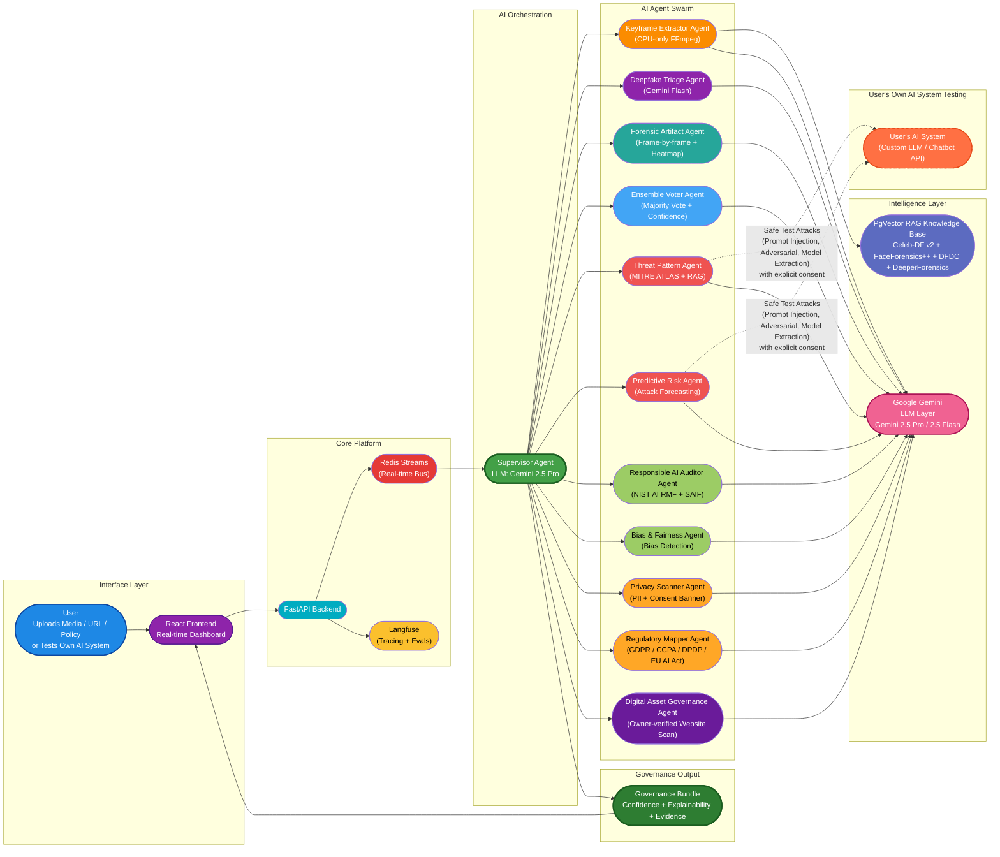

# VibeSecure

**Team:** The Build Guild

**Members:**

- [Sandipan Singh (Leader)](https://github.com/sandipansingh)
- [Zulekha Aalmi](https://github.com/Zulekha01)
- [Shakshi Kotwala](https://github.com/Shakshi-Kotwala)
- Kartavya Kumar
- Karman Singh Chandok

**[Watch Demo Video](https://youtu.be/40hJxE1rz_k)**

---

## About VibeSecure

VibeSecure is a **complete AI-native governance platform** that helps individuals, creators, developers, businesses, governments, and enterprises safely manage AI-generated content, websites, and custom AI systems.

It solves the real-world problems created by generative AI: deepfakes, AI-powered attacks, lack of ethical oversight, and regulatory non-compliance. Instead of using multiple fragmented tools, users get **one unified, easy-to-use platform** that covers **all four pillars of AI and Cybersecurity Governance** plus a full website security scanning service.

Everything runs **locally** in Docker -- your data never leaves your machine.

---

## The Four Pillars + Fifth Service

1. **Deepfake Detection Service**
2. **AI Threat Intelligence Service** (including testing of user's own AI systems)
3. **Responsible AI Frameworks Service**
4. **Data Privacy and Regulatory Compliance Service**
5. **Digital Asset Governance Service** (Owner-based Website Security Scanning)

---

## How Every Feature Works

### 1. Deepfake Detection Service

- User uploads a **photo** or **short video** (up to 5 minutes).
- **Keyframe Extractor Agent** (CPU-only, FFmpeg) intelligently picks 8-15 representative frames.
- **Deepfake Triage Agent** does a fast first-pass check with Gemini Flash.
- **Forensic Artifact Agent** performs detailed frame-by-frame analysis (facial inconsistencies, lighting mismatches, temporal anomalies, audio artifacts).
- **Ensemble Voter Agent** combines all results and does semantic similarity search in the RAG knowledge base (Celeb-DF v2, FaceForensics++, DFDC, DeeperForensics).
- Output: Confidence score, visual heatmap overlay, plain-English explanation, and dataset match notes.

### 2. AI Threat Intelligence Service (Including Custom AI System Testing)

- **For uploaded content**: Scans for hidden adversarial patterns, suspicious text, or API behavior.
- **Testing your own AI system**:
  - User provides their own AI system's **API endpoint** plus authentication.
  - With **explicit consent**, the **Threat Pattern Agent** generates and sends safe test attacks (prompt injection, adversarial inputs, model extraction queries).
  - The **Predictive Risk Agent** analyzes responses and calculates a risk score.
  - Report shows exact successful attacks, risk score, and ready-to-apply fixes.

### 3. Responsible AI Frameworks Service

- User uploads AI-generated content or describes their AI system.
- **Responsible AI Auditor Agent** and **Bias and Fairness Agent** evaluate against NIST AI Risk Management Framework and Google Secure AI Framework (SAIF).
- Produces a **simple scorecard** (Transparency, Fairness, Accountability, Safety, etc.).
- Gives plain-English suggestions with full reasoning trace for developers.

### 4. Data Privacy and Regulatory Compliance Service

- **Privacy Scanner Agent** detects PII, missing or weak consent banners, and privacy policy gaps.
- **Regulatory Mapper Agent** maps findings to exact articles of GDPR, CCPA, DPDP Act (India), and EU AI Act.
- Generates professional **compliance reports** (JSON).

### 5. Digital Asset Governance Service (Owner-based Website Security Scanning)

- **Mandatory ownership verification**: User places a token on their domain.
- After verification, runs full checks (security headers, TLS, CORS, cookies, exposed endpoints, vulnerable libraries).
- Can use Playwright for JavaScript rendering and OWASP ZAP for active testing (with consent).
- Results can automatically feed into Privacy Scanner and Regulatory Mapper for cross-service analysis.

---

## System Architecture


```mermaid
flowchart LR


%% ================= INTERFACE LAYER =================

subgraph Interface_Layer["Interface Layer"]

direction LR

User(["User<br/>Uploads Media / URL / Policy<br/>or Tests Own AI System"])

Frontend(["React Frontend<br/>Real-time Dashboard"])

User --> Frontend

end


%% ================= CORE PLATFORM =================

subgraph Core_Platform["Core Platform"]

direction LR

FastAPI(["FastAPI Backend"])

Redis(["Redis Streams<br/>(Real-time Bus)"])

Langfuse(["Langfuse<br/>(Tracing + Evals)"])

FastAPI --> Redis

FastAPI --> Langfuse

end


Frontend --> FastAPI


%% ================= AI ORCHESTRATION =================

subgraph AI_Orchestration["AI Orchestration"]

direction LR

Supervisor(["Supervisor Agent<br/>LLM: Gemini 2.5 Pro"])

end

Redis --> Supervisor


%% ================= AI AGENT SWARM =================

subgraph AI_Agent_Swarm["AI Agent Swarm"]

direction LR

Keyframe(["Keyframe Extractor Agent<br/>(CPU-only FFmpeg)"])

Triage(["Deepfake Triage Agent<br/>(Gemini Flash)"])

Forensic(["Forensic Artifact Agent<br/>(Frame-by-frame + Heatmap)"])

Voter(["Ensemble Voter Agent<br/>(Majority Vote + Confidence)"])

ThreatPattern(["Threat Pattern Agent<br/>(MITRE ATLAS + RAG)"])

Predictive(["Predictive Risk Agent<br/>(Attack Forecasting)"])

Auditor(["Responsible AI Auditor Agent<br/>(NIST AI RMF + SAIF)"])

Bias(["Bias & Fairness Agent<br/>(Bias Detection)"])

PrivacyScan(["Privacy Scanner Agent<br/>(PII + Consent Banner)"])

Regulatory(["Regulatory Mapper Agent<br/>(GDPR / CCPA / DPDP / EU AI Act)"])

DigitalAsset(["Digital Asset Governance Agent<br/>(Owner-verified Website Scan)"])


Supervisor --> Keyframe

Supervisor --> Triage

Supervisor --> Forensic

Supervisor --> Voter

Supervisor --> ThreatPattern

Supervisor --> Predictive

Supervisor --> Auditor

Supervisor --> Bias

Supervisor --> PrivacyScan

Supervisor --> Regulatory

Supervisor --> DigitalAsset

end


%% ================= USER'S AI SYSTEM TESTING =================

subgraph UserAISystem["User's Own AI System Testing"]

direction LR

UserAISystemNode(["User's AI System<br/>(Custom LLM / Chatbot API)"])

end


ThreatPattern -.-> |"Safe Test Attacks<br/>(Prompt Injection, Adversarial, Model Extraction)<br/>with explicit consent"| UserAISystemNode

Predictive -.-> |"Safe Test Attacks<br/>(Prompt Injection, Adversarial, Model Extraction)<br/>with explicit consent"| UserAISystemNode


%% ================= KNOWLEDGE + MODEL LAYER =================

subgraph Intelligence_Layer["Intelligence Layer"]

direction LR

PgVector(["PgVector RAG Knowledge Base<br/>Celeb-DF v2 + FaceForensics++ + DFDC + DeeperForensics"])

Gemini(["Google Gemini<br/>LLM Layer<br/>Gemini 2.5 Pro / 2.5 Flash"])

end


Keyframe --> PgVector

Keyframe --> Gemini

Triage --> Gemini

Forensic --> Gemini

Voter --> Gemini

ThreatPattern --> Gemini

Predictive --> Gemini

Auditor --> Gemini

Bias --> Gemini

PrivacyScan --> Gemini

Regulatory --> Gemini

DigitalAsset --> Gemini


%% ================= OUTPUT =================

subgraph Governance_Output["Governance Output"]

direction LR

Results(["Governance Bundle<br/>Confidence + Explainability + Evidence"])

end


Supervisor --> Results

Results --> Frontend


%% ================= COLORS =================

style User fill:#1E88E5,color:#fff,stroke:#0D47A1,stroke-width:2px

style Frontend fill:#8E24AA,color:#fff,stroke:#4A148C


style FastAPI fill:#00ACC1,color:#fff

style Redis fill:#E53935,color:#fff

style Langfuse fill:#FBC02D,color:#000


style Supervisor fill:#43A047,color:#fff,stroke:#1B5E20,stroke-width:3px


style Keyframe fill:#FB8C00,color:#fff

style Triage fill:#8E24AA,color:#fff

style Forensic fill:#26A69A,color:#fff

style Voter fill:#42A5F5,color:#fff

style ThreatPattern fill:#EF5350,color:#fff

style Predictive fill:#EF5350,color:#fff

style Auditor fill:#9CCC65,color:#000

style Bias fill:#9CCC65,color:#000

style PrivacyScan fill:#FFA726,color:#000

style Regulatory fill:#FFA726,color:#000

style DigitalAsset fill:#6A1B9A,color:#fff


style PgVector fill:#5C6BC0,color:#fff

style Gemini fill:#F06292,color:#fff,stroke:#AD1457,stroke-width:2px


style UserAISystemNode fill:#FF7043,color:#fff,stroke:#E64A19,stroke-width:2px,stroke-dasharray:5 5

style Results fill:#2E7D32,color:#fff,stroke:#1B5E20,stroke-width:3px
```

---

## AI Agent Swarm

VibeSecure runs **12 specialized AI agents** orchestrated by a Supervisor. Each agent handles a distinct part of the governance pipeline. Agents communicate through a shared LangGraph state and publish real-time events via Redis Streams.

### Supervisor Agent

|             |                                   |
| ----------- | --------------------------------- |
| **Role**    | Orchestrator / brain of the swarm |
| **Model**   | Gemini 2.5 Pro (brain-tier)       |
| **Used by** | All five services                 |

- Decides which agents to activate based on the selected service type and input data.
- Routes work to the correct agent pipeline (deepfake, threat intel, responsible AI, privacy, digital asset — or all at once).
- After all agents finish, synthesizes every result into a single **Governance Bundle** with an executive summary, overall risk level, confidence score, key findings, and prioritized recommended actions.

---

### Deepfake Detection Service Agents

#### 1. Keyframe Extractor Agent

|           |                                                           |
| --------- | --------------------------------------------------------- |
| **Role**  | Extract representative frames from video / prepare images |
| **Tools** | FFmpeg (CPU-only), FFprobe                                |
| **Model** | None (pure compute)                                       |

- For **video**: runs FFmpeg scene-change detection (`select='gt(scene,0.3)'`) to pick key moments, then falls back to uniform time-based sampling if fewer than 8 frames are found. Caps at 15 frames.
- For **images**: copies the file directly as a single frame.
- Outputs an ordered list of JPEG frame paths plus file metadata (type, duration, resolution) consumed by every downstream deepfake agent.

#### 2. Deepfake Triage Agent

|           |                                |
| --------- | ------------------------------ |
| **Role**  | Fast first-pass deepfake check |
| **Model** | Gemini Flash (multimodal)      |

- Picks up to **4 sample frames** from the Keyframe Extractor output.
- Sends them as inline image parts to Gemini Flash with a structured triage prompt.
- Returns a quick **triage verdict** (`likely_real`, `likely_fake`, `suspicious`) and a confidence score.
- If suspicious or fake, flags the job for deeper Forensic analysis.

#### 3. Forensic Artifact Agent

|           |                                         |
| --------- | --------------------------------------- |
| **Role**  | Deep frame-by-frame forensic analysis   |
| **Model** | Gemini 2.5 Pro (brain-tier, multimodal) |

- Processes **all frames** in batches of 5 via the multimodal API.
- Looks for facial inconsistencies, lighting mismatches, edge artifacts, temporal anomalies, and compression signatures.
- Separately analyzes the **audio track** (if present) for voice cloning artifacts, lip-sync mismatches, and unnatural pauses.
- Produces per-frame forensic annotations, an overall authenticity score, and a list of detected artifact types.

#### 4. Ensemble Voter Agent

|           |                                                   |
| --------- | ------------------------------------------------- |
| **Role**  | Combine all deepfake results into a final verdict |
| **Model** | Gemini 2.5 Pro (brain-tier) + PgVector RAG        |

- Collects votes from Triage, Forensic (visual + audio), and any additional signals.
- Runs a **weighted majority vote** — confidence-adjusted — to produce a single verdict.
- Performs **semantic similarity search** against the RAG knowledge base (Celeb-DF v2, FaceForensics++, DFDC, DeeperForensics) to find matching deepfake patterns.
- Outputs the final verdict, combined confidence score, plain-English explanation, heatmap overlay data, and dataset match notes.

---

### AI Threat Intelligence Service Agents

#### 5. Threat Pattern Agent

|               |                                                       |
| ------------- | ----------------------------------------------------- |
| **Role**      | Detect AI threats & safely test user's own AI systems |
| **Model**     | Gemini 2.5 Pro (brain-tier)                           |
| **Framework** | MITRE ATLAS                                           |

- **Content analysis mode**: scans uploaded text/content for hidden adversarial patterns, prompt injection payloads, social engineering, data exfiltration patterns, and model manipulation techniques. Maps every finding to a MITRE ATLAS technique ID.
- **Live AI system testing mode** (requires explicit consent): sends safe, non-destructive test attacks against the user's API endpoint:
  - **Prompt injection** — system prompt extraction, instruction override attempts.
  - **Adversarial inputs** — SQL injection, XSS, path traversal, env variable leak.
  - **Model extraction** — queries that try to reveal model type, capabilities, training data, or internal config.
- Records each attack, the system's response, and whether the attack succeeded.

#### 6. Predictive Risk Agent

|           |                                        |
| --------- | -------------------------------------- |
| **Role**  | Attack forecasting and risk prediction |
| **Model** | Gemini 2.5 Pro (brain-tier)            |

- Ingests results from the Threat Pattern Agent and any other completed agents.
- Performs five analyses:
  1. **Attack Vector Prediction** — most likely future attacks based on current vulnerabilities.
  2. **Risk Trajectory** — whether risk is increasing, stable, or decreasing.
  3. **Attack Surface Map** — which components are most exposed.
  4. **Threat Actor Profiling** — likely attacker type (script kiddie → nation state), motivation, and required capability.
  5. **Mitigation Priority** — highest-impact fixes ranked by urgency.
- Outputs a 0-100 risk score, risk level, predicted attacks with probabilities, and a prioritized remediation list.

---

### Responsible AI Frameworks Service Agents

#### 7. Responsible AI Auditor Agent

|                |                                                   |
| -------------- | ------------------------------------------------- |
| **Role**       | Evaluate AI systems against governance frameworks |
| **Model**      | Gemini 2.5 Pro (brain-tier)                       |
| **Frameworks** | NIST AI RMF 1.0, Google SAIF                      |

- Evaluates the described AI system or AI-generated content against:
  - **NIST AI Risk Management Framework** — Govern, Map, Measure, Manage functions.
  - **Google Secure AI Framework (SAIF)** — six core principles (security foundations, detection & response, automated defenses, platform controls, adaptive controls, contextualized risk).
- Produces a **scorecard** across 8 dimensions: Transparency, Fairness, Accountability, Safety, Privacy, Security, Robustness, and Explainability (each 0-100).
- Provides plain-English suggestions with full reasoning trace.

#### 8. Bias & Fairness Agent

|           |                                       |
| --------- | ------------------------------------- |
| **Role**  | Detect and measure bias in AI outputs |
| **Model** | Gemini (standard tier)                |

- Evaluates content across **8 bias dimensions**: gender, racial, age, socioeconomic, geographic, disability, language, and cultural bias.
- For each dimension, reports whether bias is detected, severity, specific evidence, affected groups, and mitigation strategies.
- Also assesses representation, stereotype risk, accessibility, and disparate impact.
- Outputs an overall bias score (0-100) and detailed per-dimension breakdown.

---

### Data Privacy & Regulatory Compliance Service Agents

#### 9. Privacy Scanner Agent

|           |                                                              |
| --------- | ------------------------------------------------------------ |
| **Role**  | Detect PII exposure, consent issues, and privacy policy gaps |
| **Model** | Gemini (standard tier)                                       |
| **Tools** | httpx, BeautifulSoup                                         |

- Fetches the target page HTML and extracts text content.
- Runs a **consent banner checker** that looks for common cookie/GDPR banner CSS classes, element IDs, and consent management platform scripts (Cookiebot, OneTrust, Osano, Termly, CookieConsent, CookieYes).
- Sends page content to Gemini for deeper analysis: PII detection (emails, phone numbers, addresses, API keys), privacy policy completeness, third-party tracker identification, and data collection practice assessment.
- Outputs a structured report of all PII found, consent banner status, and privacy gaps.

#### 10. Regulatory Mapper Agent

|                 |                                              |
| --------------- | -------------------------------------------- |
| **Role**        | Map privacy findings to specific regulations |
| **Model**       | Gemini 2.5 Pro (brain-tier)                  |
| **Regulations** | GDPR, CCPA, DPDP Act (India), EU AI Act      |

- Takes findings from the Privacy Scanner (and any other agents) and maps each issue to the **exact article or section** of applicable regulations:
  - **GDPR** — Art. 5-49 (consent, transparency, data subject rights, breach notification, DPIAs, international transfers).
  - **CCPA** — §1798.100-135 (right to know, delete, opt-out, non-discrimination).
  - **DPDP Act** — Sections 4-15 (consent, data fiduciary obligations, children's data, data principal rights).
  - **EU AI Act** — risk categories (unacceptable, high, limited, minimal) and corresponding obligations.
- Generates a professional **compliance report** with per-regulation findings, applicable articles, and remediation steps.

---

### Digital Asset Governance Service Agent

#### 11. Digital Asset Governance Agent

|           |                                                     |
| --------- | --------------------------------------------------- |
| **Role**  | Owner-verified website security scanning            |
| **Model** | Gemini (standard tier)                              |
| **Tools** | Playwright, OWASP ZAP, 8 built-in security checkers |

- **Requires domain ownership verification** — the user must place a token file on their domain before scanning.
- Runs **9 security checks** against the verified URL:
  1. **TLS** — certificate validity, protocol version, cipher strength.
  2. **CORS** — misconfigured cross-origin policies.
  3. **Endpoints** — exposed admin panels, APIs, debug routes.
  4. **Security Headers** — CSP, HSTS, X-Frame-Options, X-Content-Type-Options, etc.
  5. **HTTPS Redirect** — whether HTTP properly redirects to HTTPS.
  6. **Directory Listing** — exposed directory indexes.
  7. **Libraries** — known vulnerable JavaScript/CSS libraries.
  8. **Reflections** — reflected input that could indicate XSS vectors.
- Optionally uses **Playwright** for JavaScript-rendered pages (SPAs, cookie analysis, mixed content) and **OWASP ZAP** for active testing (with additional consent).
- Normalizes all findings into a 0-100 risk score and can automatically feed results into the Privacy Scanner and Regulatory Mapper for cross-service analysis.

---

## 🚀 Local Setup

1. **Clone the repository**
2. **Configure Environment**
   ```bash
   cp .env.example .env
   ```
   Then fill in your API keys and credentials in `.env`.
3. **Start Services**
   ```bash
   docker compose up --build
   ```
4. **Access**
   - API: http://localhost:8000
   - Docs: http://localhost:8000/docs
   - Client: http://localhost:3000

## License

Distributed under the MIT License. See `LICENSE` for more information.

---

Built with care by The Build Guild
