# VibeSecure

**Team:** The Build Guild

**Members:**

- [Sandipan Singh (Leader)](https://github.com/sandipansingh)
- [Zulekha Aalmi](https://github.com/Zulekha01)
- [Shakshi Kotwala](https://github.com/Shakshi-Kotwala)
- Kartavya Kumar

**[Watch Demo Video](https://youtu.be/5bEbh1KOYpE)**

---

## 🎯 Problem Statement

The rise of **vibe-coded and AI-generated websites** has dramatically reduced development time, enabling developers to ship prototypes and MVPs in hours instead of weeks. However, this speed comes at a cost: **many websites are being deployed to production without basic security hardening**.

Most developers launching fast prototypes skip essential security configurations:

- **Missing Security Headers**: No Content-Security-Policy, HSTS, X-Frame-Options
- **Unsafe Cookie Policies**: Session cookies without Secure, HttpOnly, SameSite flags
- **Open CORS Policies**: Wildcard origins allowing unauthorized API access
- **Exposed Endpoints**: Admin panels, debug routes, .env files accessible publicly
- **Unpatched Libraries**: Frontend dependencies with known vulnerabilities

Traditional security tools are **too complex, intrusive, or time-consuming** for rapid development workflows. Developers need a solution that:

- Works with their fast-paced, prototype-first approach
- Provides actionable fixes, not just vulnerability reports
- Doesn't require security expertise to interpret
- Prevents unauthorized scanning and ensures legal compliance

**There is a clear need for a lightweight, developer-friendly security solution that helps website owners detect and fix common risks before deployment.**

## 💡 Our Solution

**VibeSecure** is an **owner-authorized web security scanning platform** designed specifically for modern vibe-coded and AI-generated websites.

### How It Works

1. **Provide Your URL**: Submit your website URL for security analysis
2. **Verify Ownership**: Place a verification token on your domain (like Google Search Console)
3. **Automated Scanning**: VibeSecure performs comprehensive security checks:
   - Security headers analysis (CSP, HSTS, X-Frame-Options)
   - HTTPS/TLS configuration validation
   - CORS policy assessment
   - Exposed endpoint detection (.env, admin panels, backups)
   - Cookie security evaluation
   - Frontend library vulnerability scanning
   - Optional: JavaScript rendering for SPAs
   - Optional: OWASP ZAP active vulnerability testing (requires explicit consent)
4. **Get Actionable Results**: Clean dashboard with severity-rated findings
5. **Fix Quickly**: Copy-paste platform-specific configurations (Vercel, Netlify, Nginx, Apache)
6. **AI-Powered Guidance**: Google Gemini generates remediation checklists prioritized by impact

### Safe-by-Default Design

To prevent misuse and ensure legal compliance, VibeSecure enforces **mandatory domain ownership verification** before any scan. Advanced scanning modes (OWASP ZAP active testing) require an additional explicit consent token, similar to how DNS configuration proves server control.

### Impact

VibeSecure bridges the gap between **rapid AI-assisted development** and **real-world security readiness** by making security scanning:

- **Accessible**: Simple workflow for non-security experts
- **Safe**: Owner-authorized to prevent abuse
- **Practical**: Platform-specific fixes for immediate deployment
- **Fast**: Automated scanning with email notifications

It helps teams **launch prototypes and production sites with confidence**, reducing exposure to preventable vulnerabilities that could lead to data breaches, XSS attacks, or compliance violations.

## Opportunities & Market Fit

- **AI/Vibe-Coded MVPs**: Security checks before rapid deployments
- **Indie Developers**: Owner-authorized scans for side projects
- **Agencies**: Client audits backed by domain ownership verification
- **DevSecOps-Friendly**: API-based scanning designed for future CI/CD automation

## 🔍 How VibeSecure is Different

| Feature                    | Traditional Scanners      | VibeSecure                                     |
| -------------------------- | ------------------------- | ---------------------------------------------- |
| **Target Audience**        | Security professionals    | Vibe-coders, indie devs, startups              |
| **Domain Verification**    | Optional or absent        | Mandatory before any scan                      |
| **Active Scan Consent**    | Not required              | Explicit token-based authorization             |
| **Report Complexity**      | Technical security jargon | Developer-friendly, actionable fixes           |
| **Platform Integration**   | Manual configuration      | Auto-generated configs (Vercel, Netlify, etc.) |
| **AI-Powered Guidance**    | Generic findings          | Gemini-generated prioritized checklists        |
| **Modern Web Support**     | Static analysis only      | JavaScript rendering with Playwright           |
| **Authentication Testing** | Limited                   | Multiple auth types (OAuth, Bearer, Cookie)    |
| **Deployment Speed**       | Complex setup             | Docker one-command deployment                  |
| **Legal Protection**       | User responsibility       | Built-in ownership proof + audit trail         |

## ✨ Key Features

### Security & Authorization

- **Cryptographic Domain Verification** - Token-based ownership proof (file, meta tag, or HTTP header)
- **Two-Stage Authorization** - Separate consent for passive and active scanning
- **Audit Trail** - Complete logging of all verification and scanning activities
- **Token Expiration** - Time-bound verification tokens for security

### Comprehensive Scanning

- **9 Security Scanners**: Headers, TLS, CORS, Directories, Endpoints, Libraries, Reflections, JS Rendering, OWASP ZAP
- **Passive Scanning** - Non-invasive security checks (headers, TLS, CORS)
- **Active Scanning** - OWASP ZAP integration for vulnerability testing (with consent)
- **JavaScript Rendering** - Playwright for SPA/PWA analysis
- **Endpoint Discovery** - Wordlist probing with configurable intensity
- **Reflection Testing** - Safe parameter reflection detection

### Developer Experience

- **AI-Powered Summaries** - Google Gemini generates actionable remediation guidance
- **Multi-Format Reports** - JSON and PDF exports
- **Platform-Specific Fixes** - Copy-paste configurations for Vercel, Netlify, Nginx, Apache
- **Email Notifications** - Automated scan completion alerts
- **RESTful API** - Complete API for integration
- **Real-Time Status** - Live scan progress tracking

### Authentication & Integration

- **Firebase Authentication** - Enterprise-grade user management
- **Multiple Auth Types** - Support for Basic, Bearer, Cookie authentication
- **Asynchronous Architecture** - Non-blocking scans using Celery and Redis
- **Docker Deployment** - Production-ready containerization

## 🔧 Google Technologies Used

### 1. **Firebase Authentication**

- **Purpose**: User authentication and session management
- **Implementation**:
  - OAuth 2.0 integration for secure login
  - JWT token-based API authentication
  - User profile management
  - Email verification
- **Benefits**:
  - Enterprise-grade security
  - Multi-provider support (Google, Email/Password)
  - Automatic token refresh and validation
  - Seamless frontend-backend integration

### 2. **Google Gemini AI**

- **Purpose**: AI-powered vulnerability analysis and remediation guidance
- **Implementation**:
  - Scan result summarization
  - Risk assessment and prioritization
  - Actionable remediation checklists
  - Natural language security recommendations
- **Benefits**:
  - Converts complex security findings into developer-friendly guidance
  - Prioritizes fixes by impact and effort
  - Provides context-aware remediation steps
  - Reduces time from detection to resolution

  - Reduces time from detection to resolution

## 📊 Process Flow Diagram


## 🏗️ System Architecture

```mermaid
flowchart LR
    User[👤 User] --> Frontend[⚛️ React Frontend]
    Frontend -->|JWT Auth| API[🚀 FastAPI]

    API --> Firebase[🔐 Firebase]
    API --> DB[(🗄️ PostgreSQL)]
    API --> Cache[(⚡ Redis)]

    Cache -->|Queue Tasks| Worker[⚙️ Celery Workers]

    Worker --> Scanners[🔍 Security Scanners]
    Worker --> Playwright[🎭 JS Renderer]
    Worker --> ZAP[🛡️ OWASP ZAP]

    Worker --> AI[🤖 Gemini AI]
    Worker --> Email[📧 Resend API]

    Worker --> DB
    Email --> User

    style API fill:#4f46e5
    style Worker fill:#dc2626
    style DB fill:#2563eb
    style Cache fill:#ef4444
```



### Architecture Components

**Frontend Layer**

- React + Vite for fast, modern UI
- TailwindCSS for responsive design
- Firebase SDK for authentication

**Backend Layer**

- FastAPI for high-performance REST API
- Firebase Auth middleware for JWT validation
- Rate limiting and CORS middleware

**Data Layer**

- PostgreSQL for persistent storage (scans, findings, domains, consent)
- Redis for caching and message brokering
- SQLModel ORM for type-safe database operations

**Worker Layer**

- Celery for distributed task processing
- 9 specialized security scanners
- Playwright for JavaScript rendering
- OWASP ZAP for active vulnerability scanning

**External Services**

- Google Gemini for AI-powered analysis
- Resend API for email notifications
- Firebase Authentication for user management

## 🛠️ Tech Stack

[](https://skillicons.dev)


### Backend Technologies

**Core Framework**

- **Python 3.10+** - Modern Python with type hints
- **FastAPI 0.109+** - High-performance async web framework
- **Uvicorn** - Lightning-fast ASGI server
- **Pydantic** - Data validation with Python type annotations

**Database & ORM**

- **PostgreSQL** - Production-grade relational database
- **SQLModel 0.0.14+** - SQL databases with Python type hints (combines SQLAlchemy + Pydantic)
- **psycopg2-binary 2.9+** - PostgreSQL adapter

**Task Queue & Caching**

- **Celery 5.3+** - Distributed task queue for async processing
- **Redis 5.0+** - In-memory data store for caching and message broker

**Security Scanning**

- **Playwright 1.40+** - Headless browser automation for JavaScript rendering
- **OWASP ZAP** - Active vulnerability scanner
- **BeautifulSoup4 4.12+** - HTML/XML parsing for content analysis
- **httpx 0.26+** - Async HTTP client for scanning requests

**Authentication & Authorization**

- **Firebase Admin SDK 6.0+** - Backend authentication and user management
- **JWT tokens** - Stateless authentication

**AI & Reporting**

- **Google Gemini (google-genai 0.1+)** - AI-powered vulnerability analysis
- **ReportLab 3.6+** - PDF report generation

**Integrations**

- **Resend 0.7+** - Transactional email API

**Utilities**

- **python-dotenv 1.0+** - Environment variable management
- **python-multipart** - File upload support

### Frontend Technologies

**Core Framework**

- **React 18.3+** - Modern UI library with hooks
- **React DOM 18.3+** - React renderer for web
- **Vite 5.1+** - Next-generation frontend tooling

**Routing & State**

- **React Router DOM 6.22+** - Declarative routing for React

**Styling**

- **TailwindCSS 3.4+** - Utility-first CSS framework
- **PostCSS 8.4+** - CSS transformations
- **Autoprefixer 10.4+** - Auto vendor prefixes

**UI & Animation**

- **Framer Motion 11.0+** - Production-ready animation library
- **Lucide React 0.344+** - Beautiful, consistent icons

**Authentication**

- **Firebase SDK 12.8+** - Frontend authentication (Google OAuth, Email/Password)

### DevOps & Deployment

- **Docker** - Containerization for consistent environments
- **Docker Compose** - Multi-container orchestration
- **Git** - Version control

### Development Tools

- **ESLint** - JavaScript/React linting
- **Vite Plugin React** - Fast refresh and JSX support

---

**Full Stack Summary:**  
Modern Python async backend (FastAPI + Celery) with React SPA frontend, PostgreSQL database, Redis caching, Firebase auth, Google Gemini AI, and containerized deployment.

## 🚀 Local Setup

1. **Clone the repository**
2. **Configure Environment**
   - Create a `.env` file in the root directory.
   - Add necessary Firebase, Database, and API keys.
3. **Start Services**
   ```bash
   docker-compose up --build
   ```
4. **Access**
   - API: http://localhost:8000
   - Docs: http://localhost:8000/docs
   - Client: http://localhost:3000

## API Reference

All authenticated endpoints require a Firebase JWT token in the `Authorization` header: `Bearer <token>`.

### Authentication

#### POST /api/auth/login

Login with Firebase token.

**Body:**

```json
{
  "firebase_token": "eyJhbGciOiJSUzI1Ni..."
}
```

#### GET /api/auth/profile

Get current user profile.

**Response:**

```json
{
  "uid": "12345",
  "email": "user@example.com",
  "name": "User Name",
  "email_verified": true,
  "picture": "..."
}
```

### Domain Verification

#### POST /api/domains/verify/request

Generate a verification token for a domain.

**Body:**

```json
{
  "domain": "example.com"
}
```

**Response:**

```json
{
  "domain": "example.com",
  "token": "vs_abc123",
  "instructions": {
    "file": { "path": "/.well-known/...", "content": "..." },
    "meta": "...",
    "header": { "name": "...", "value": "..." }
  }
}
```

#### POST /api/domains/verify/check

Verify that the token has been placed on the domain.

**Body:**

```json
{
  "domain": "example.com"
}
```

#### DELETE /api/domains/verify/request

Delete pending verification requests for a domain.

**Query:** `?domain=example.com`

**Response:**

```json
{
  "message": "Deleted 1 pending verification request(s) for example.com",
  "domain": "example.com",
  "deleted_count": 1
}
```

#### GET /api/domains/{domain}/status

Check verification status of a domain.

**Response:**

```json
{
  "domain": "example.com",
  "verified": true,
  "verified_at": "2026-01-30T12:00:00",
  "verified_by_method": "file",
  "expires_at": "2026-02-30T12:00:00"
}
```

#### GET /api/domains/list

List all verified domains for the authenticated user.

**Response:**

```json
[
  {
    "domain": "example.com",
    "verified": true,
    "verified_at": "2026-01-30T12:00:00",
    "verified_by_method": "file",
    "expires_at": "2026-02-30T12:00:00"
  }
]
```

### Active Scan Consent

#### POST /api/consent/request

Request consent token for invasive active scanning.

**Body:**

```json
{
  "domain": "example.com"
}
```

#### POST /api/consent/check

Verify active scan consent file.

**Body:**

```json
{
  "domain": "example.com"
}
```

#### GET /api/consent/{domain}/status

Check active scan consent status for a domain.

**Response:**

```json
{
  "domain": "example.com",
  "active_allowed": true,
  "active_consent_verified": true,
  "verified_at": "2026-01-30T12:00:00",
  "method": "well-known"
}
```

#### GET /api/consent/list

List all active scan consents for the authenticated user.

**Response:**

```json
{
  "consents": [
    {
      "id": "uuid",
      "domain": "example.com",
      "active_allowed": true,
      "verified_at": "2026-01-30T12:00:00",
      "method": "well-known",
      "created_at": "2026-01-30T12:00:00"
    }
  ],
  "total": 1
}
```

### Scans

#### POST /api/scans

Start a new security scan.

**Body:**

```json
{
  "url": "https://example.com",
  "options": {
    "allow_active": false,
    "ignore_robots": false,
    "render_js": true,
    "wordlist_profile": "default",
    "check_reflections": false,
    "auth": {
      "type": "basic",
      "username": "user",
      "password": "pass"
    }
  }
}
```

**Options:**

- `allow_active` (boolean): Enable active vulnerability scanning (OWASP ZAP). Requires active scan consent. Default: `false`
- `ignore_robots` (boolean): Bypass robots.txt restrictions. Default: `false`
- `render_js` (boolean): Enable JavaScript rendering with Playwright for SPAs. Default: `false`
- `wordlist_profile` (string): Endpoint discovery intensity - `"minimal"`, `"default"`, or `"deep"`. Default: `"default"`
- `check_reflections` (boolean): Test for parameter reflection using benign tokens. Default: `false`
- `auth` (object): Authentication credentials for protected resources:
  - `type`: `"basic"`, `"bearer"`, or `"cookie"`
  - For basic: `username` and `password`
  - For bearer: `token`
  - For cookie: `cookie` string

**Response:**

```json
{
  "id": "scan-uuid",
  "status": "queued"
}
```

#### GET /api/scans

List all scans for the authenticated user.

**Query Parameters:**

- `skip` (int): Offset for pagination. Default: `0`
- `limit` (int): Number of results (1-100). Default: `20`

**Response:**

```json
[
  {
    "id": "scan-uuid",
    "url": "https://example.com",
    "status": "completed",
    "created_at": "2026-01-30T12:00:00"
  }
]
```

#### GET /api/scans/{scan_id}

Get status and details of a specific scan.

#### GET /api/scans/{scan_id}/findings

Get list of security vulnerabilities found.

**Response:**

```json
[
  {
    "title": "Missing Content-Security-Policy",
    "severity": "medium",
    "description": "...",
    "remediation": "..."
  }
]
```

#### POST /api/scans/{scan_id}/findings

Manually add a finding to a scan.

**Body:**

```json
{
  "title": "Custom Security Issue",
  "severity": "high",
  "description": "Detailed description",
  "remediation": "How to fix",
  "evidence": "Supporting evidence"
}
```

**Response:**

```json
{
  "id": "finding-uuid",
  "scan_id": "scan-uuid",
  "title": "Custom Security Issue",
  "severity": "high"
}
```

### Reports & AI

#### GET /api/scans/{scan_id}/ai-summary

Get an AI-generated summary and remediation checklist.

#### GET /api/scans/{scan_id}/report

Download full report.
**Query:** `?format=json` or `?format=pdf`

#### GET /api/scans/{scan_id}/fix-config

Get copy-paste valid configuration files for remediation.
**Query:** `?platform=vercel` (or netlify, nginx, apache)

## License

Distributed under the MIT License. See `LICENSE` for more information.

---

Built with ❤️ by The Build Guild
